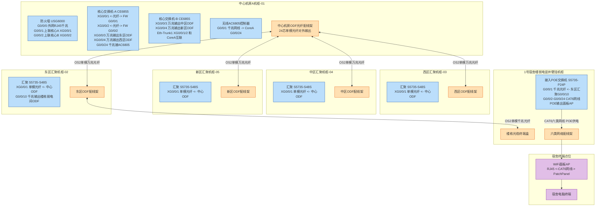

```mermaid
graph TD
    subgraph 中心机房A机柜-01
        direction TB
        FW["防火墙 USG6000<br/>G0/0/0:外网RJ45千兆<br/>G0/0/1:上联核心A XG0/0/1<br/>G0/0/2:上联核心B XG0/0/2"]
        CoreA["核心交换机-A CE6855<br/>XG0/0/1 <-光纤-> FW G0/0/1<br/>XG0/0/2 <-光纤-> FW G0/0/2<br/>XG0/0/3 万兆输出东区ODF<br/>XG0/0/4 万兆输出西区ODF<br/>G0/0/24 千兆接AC6805"]
        CoreB["核心交换机-B CE6855<br/>XG0/0/3 万兆输出中区ODF<br/>XG0/0/4 万兆输出新区ODF<br/>Eth-Trunk1 XG0/0/1/2 和CoreA互联"]
        AC["无线AC6805控制器<br/>G0/0/1 千兆网线 -> CoreA G0/0/24"]
        ODF_MAIN["中心机房ODF光纤配线架<br/>24芯单模光纤对外输出"]
    end

    subgraph 东区汇聚机柜-02
        EastAgg["汇聚 S5735-S48S<br/>XG0/0/1 单模光纤 <- 中心ODF<br/>G0/0/10 千兆输出楼栋弱电间ODF"]
        ODF_East["东区ODF配线架"]
    end

    subgraph 西区汇聚机柜-03
        WestAgg["汇聚 S5735-S48S<br/>XG0/0/1 单模光纤 <- 中心ODF"]
        ODF_West["西区ODF配线架"]
    end

    subgraph 中区汇聚机柜-04
        MidAgg["汇聚 S5735-S48S<br/>XG0/0/1 单模光纤 <- 中心ODF"]
        ODF_Mid["中区ODF配线架"]
    end

    subgraph 新区汇聚机柜-05
        NewAgg["汇聚 S5735-S48S<br/>XG0/0/1 单模光纤 <- 中心ODF"]
        ODF_New["新区ODF配线架"]
    end

    subgraph 1号宿舍楼弱电竖井壁挂机柜
        ACC["接入POE交换机 S5735-P24P<br/>G0/0/1 千兆光纤 <- 东区汇聚G0/0/10<br/>G0/0/2-G0/0/24 CAT6网线POE输出面板AP"]
        ODF_Build["楼栋光缆终端盒"]
        PatchPanel["六类网络配线架"]
    end

    subgraph 宿舍终端点位
        AP["WiFi面板AP<br/>RJ45 <-CAT6网线-> PatchPanel"]
        PC["宿舍电脑终端"]
    end

    %% 物理布线
    ODF_MAIN <-->|OS2单模万兆光纤| ODF_East
    ODF_MAIN <-->|OS2单模万兆光纤| ODF_West
    ODF_MAIN <-->|OS2单模万兆光纤| ODF_Mid
    ODF_MAIN <-->|OS2单模万兆光纤| ODF_New

    ODF_East <-->|OS2单模千兆光纤| ODF_Build
    ACC -->|CAT6六类网线 POE供电| PatchPanel
    PatchPanel --> AP
    AP --> PC

    %% 样式定义
    classDef cabinet fill:#eceff1,stroke:#455a64,stroke-width:2px
    classDef device fill:#bbdefb,stroke:#0d47a1
    classDef odf fill:#ffe0b2,stroke:#e65100
    classDef enddev fill:#e1bee7,stroke:#7b1fa2

    class FW,CoreA,CoreB,AC,EastAgg,WestAgg,MidAgg,NewAgg,ACC device
    class ODF_MAIN,ODF_East,ODF_West,ODF_Mid,ODF_New,ODF_Build,PatchPanel odf
    class AP,PC enddev
```