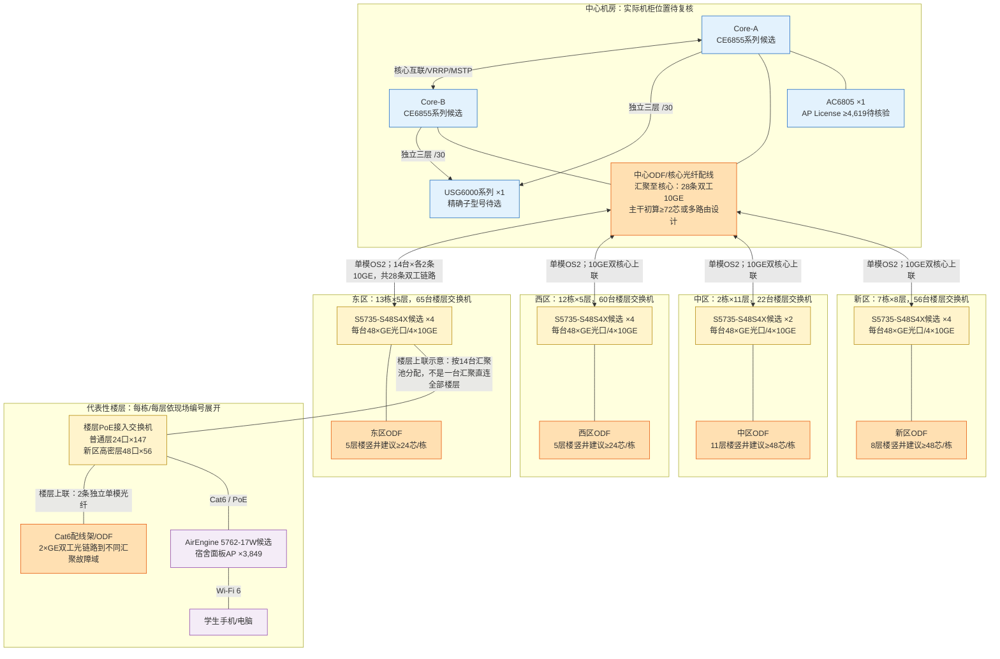

# 校园宿舍网络物理拓扑（V1.1）

> 该图是物理连接的建议基线，不是竣工图。实际机房、端口号、ODF芯号、光纤路由、供电与设备序列号需现场复测后登记。SVG 由同名 `.mmd` 渲染生成。

```mermaid
graph TD
    subgraph CoreRoom[中心机房：实际机柜位置待复核]
      CoreA["Core-A<br/>CE6855系列候选"]
      CoreB["Core-B<br/>CE6855系列候选"]
      FW["USG6000系列 ×1<br/>精确子型号待选"]
      AC["AC6805 ×1<br/>AP License ≥4,619待核验"]
      MainODF["中心ODF/核心光纤配线<br/>汇聚至核心：28条双工10GE<br/>主干初算≥72芯或多路由设计"]
      CoreA <-->|"核心互联/VRRP/MSTP"| CoreB
      CoreA -->|"独立三层 /30"| FW
      CoreB -->|"独立三层 /30"| FW
      CoreA --- MainODF
      CoreB --- MainODF
      CoreA --- AC
    end

    subgraph East[东区：13栋×5层，65台楼层交换机]
      E1["S5735-S48S4X候选 ×4<br/>每台48×GE光口/4×10GE"]
      EODF["东区ODF<br/>5层楼竖井建议≥24芯/栋"]
    end
    subgraph West[西区：12栋×5层，60台楼层交换机]
      W1["S5735-S48S4X候选 ×4<br/>每台48×GE光口/4×10GE"]
      WODF["西区ODF<br/>5层楼竖井建议≥24芯/栋"]
    end
    subgraph Middle[中区：2栋×11层，22台楼层交换机]
      M1["S5735-S48S4X候选 ×2<br/>每台48×GE光口/4×10GE"]
      MODF["中区ODF<br/>11层楼竖井建议≥48芯/栋"]
    end
    subgraph New[新区：7栋×8层，56台楼层交换机]
      N1["S5735-S48S4X候选 ×4<br/>每台48×GE光口/4×10GE"]
      NODF["新区ODF<br/>8层楼竖井建议≥48芯/栋"]
    end

    MainODF <-->|"单模OS2；14台×各2条10GE，共28条双工链路"| E1
    MainODF <-->|"单模OS2；10GE双核心上联"| W1
    MainODF <-->|"单模OS2；10GE双核心上联"| M1
    MainODF <-->|"单模OS2；10GE双核心上联"| N1
    E1 --- EODF
    W1 --- WODF
    M1 --- MODF
    N1 --- NODF

    subgraph FloorExample[代表性楼层：每栋/每层依现场编号展开]
      Access["楼层PoE接入交换机<br/>普通层24口×147<br/>新区高密层48口×56"]
      Patch["Cat6配线架/ODF<br/>2×GE双工光链路到不同汇聚故障域"]
      AP["AirEngine 5762-17W候选<br/>宿舍面板AP ×3,849"]
      Clients["学生手机/电脑"]
      Access ---|"楼层上联：2条独立单模光纤"| Patch
      Access ---|"Cat6 / PoE"| AP
      AP ---|"Wi-Fi 6"| Clients
    end
    E1 ---|"楼层上联示意：按14台汇聚池分配，不是一台汇聚直连全部楼层"| Access

    classDef core fill:#e3f2fd,stroke:#1565c0
    classDef agg fill:#fff4cc,stroke:#b28704
    classDef cable fill:#ffe0b2,stroke:#e65100
    classDef ap fill:#f4ecf7,stroke:#8e44ad
    class CoreA,CoreB,FW,AC core
    class E1,W1,M1,N1,Access agg
    class MainODF,EODF,WODF,MODF,NODF,Patch cable
    class AP,Clients ap
```
