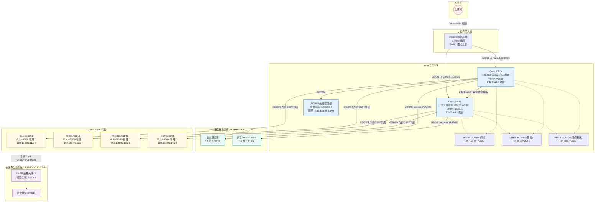

```mermaid
graph TD
    subgraph 外网区
        INTERNET((互联网))
    end

    subgraph 边界防火墙
        FW["USG6000 防火墙<br/>G0/0/0:外网<br/>G0/0/1:核心上联"]
    end

    subgraph 核心层 [Area 0 OSPF]
        Core-A[Core-SW-A<br/>192.168.99.1/24 VLAN99<br>VRRP-Master<br>Eth-Trunk1 聚合]
        Core-B[Core-SW-B<br/>192.168.99.2/24 VLAN99<br>VRRP-Backup<br>Eth-Trunk1 聚合]
        Core-A <-->|Eth-Trunk1 LACP聚合链路| Core-B
        VRRP_MGMT["VRRP-VLAN99 网关 192.168.99.254/24"]
        VRRP_V10["VRRP-VLAN10(宿舍) 10.10.0.254/16"]
        VRRP_V20["VRRP-VLAN20(服务器区) 10.20.0.254/24"]

        AC[AC6805无线控制器<br/>旁挂Core-A G0/0/24<br/>管理：192.168.99.10/24]
    end

    subgraph DMZ服务器业务区 VLAN20 10.20.0.0/24
        Server1[业务服务器<br>10.20.0.10/24]
        Server2[认证Portal/Radius<br>10.20.0.11/24]
    end

    subgraph 汇聚层 4台汇聚 [OSPF Area0邻居]
        EastAgg[East-Agg-01<br/>VLAN99/10 管理：192.168.99.11/24]
        WestAgg[West-Agg-01<br/>VLAN99/20 管理：192.168.99.12/24]
        MidAgg[Middle-Agg-01<br/>VLAN99/10 管理：192.168.99.13/24]
        NewAgg[New-Agg-01<br/>VLAN99/10 管理：192.168.99.14/24]
    end

    subgraph 宿舍办公业务区 VLAN10 10.10.0.0/16
        AP1[Fit-AP 面板无线AP<br/>动态获取10.10.x.x]
        PC1[宿舍终端PC/手机]
    end

    %% 链路关系
    INTERNET --VPN/IPSEC隧道--> FW
    FW -->|G0/0/1 -> Core-A XG0/0/1| Core-A
    FW -->|G0/0/1 -> Core-B XG0/0/2| Core-B

    Core-A -->|XG0/0/3 万兆OSPF邻居| EastAgg
    Core-A -->|XG0/0/4 万兆OSPF邻居| WestAgg
    Core-B -->|XG0/0/3 万兆OSPF邻居| MidAgg
    Core-B -->|XG0/0/4 万兆OSPF邻居| NewAgg

    EastAgg -->|千兆Trunk VLAN10,VLAN99| AP1
    AP1 --> PC1

    Core-A -->|G0/0/20 access VLAN20| Server1
    Core-B -->|G0/0/21 access VLAN20| Server2

    Core-A -.-> VRRP_MGMT
    Core-B -.-> VRRP_MGMT
    Core-A -.-> VRRP_V10
    Core-B -.-> VRRP_V10
    Core-A -.-> VRRP_V20
    Core-B -.-> VRRP_V20

    Core-A -->|G0/0/24| AC

    %% 样式
    classDef outer fill:#ffecec,stroke:#c0392b
    classDef core fill:#e3f2fd,stroke:#1565c0
    classDef serverzone fill:#e8f8f5,stroke:#16a085
    classDef agg fill:#fef9e7,stroke:#d4ac0d
    classDef userzone fill:#f4ecf7,stroke:#8e44ad

    class INTERNET outer
    class Core-A,Core-B,AC core
    class Server1,Server2 serverzone
    class EastAgg,WestAgg,MidAgg,NewAgg agg
    class AP1,PC1 userzone
```