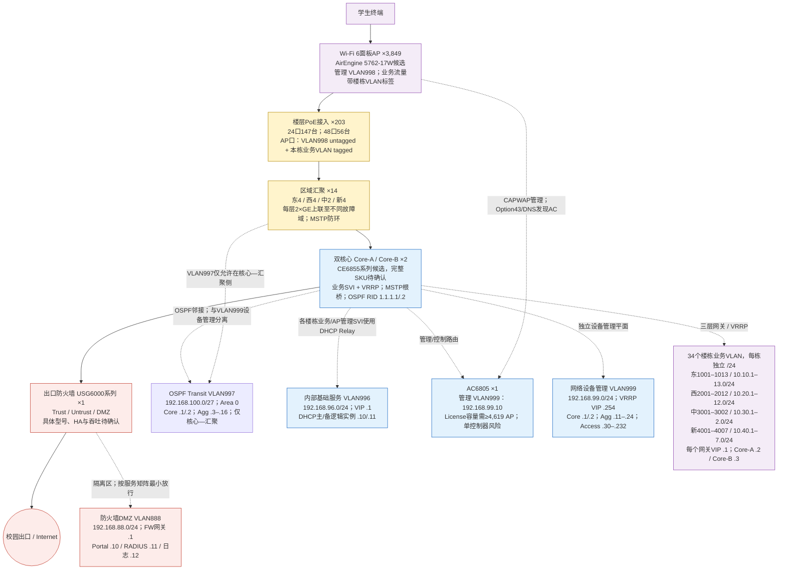

# 校园宿舍网络逻辑拓扑（V1.1）

> Mermaid 源文件为图形编辑源，规划参数以仓库根目录 `00-统一规划基线.md` 为准。SVG 由 `逻辑.mmd` 渲染生成。图示为方案，不是竣工证明。

```mermaid
flowchart TB
    Client["学生终端"] --> AP["Wi-Fi 6面板AP ×3,849<br/>AirEngine 5762-17W候选<br/>管理 VLAN998；业务流量带楼栋VLAN标签"]
    AP --> Access["楼层PoE接入 ×203<br/>24口147台；48口56台<br/>AP口：VLAN998 untagged + 本栋业务VLAN tagged"]
    Access --> Agg["区域汇聚 ×14<br/>东4 / 西4 / 中2 / 新4<br/>每层2×GE上联至不同故障域；MSTP防环"]
    Agg --> Core["双核心 Core-A / Core-B ×2<br/>CE6855系列候选，完整SKU待确认<br/>业务SVI + VRRP；MSTP根桥；OSPF RID 1.1.1.1/.2"]
    Core --> FW["出口防火墙 USG6000系列 ×1<br/>Trust / Untrust / DMZ<br/>具体型号、HA与吞吐待确认"]
    FW --> Internet(("校园出口 / Internet"))

    Transit["OSPF Transit VLAN997<br/>192.168.100.0/27；Area 0<br/>Core .1/.2；Agg .3–.16；仅核心—汇聚"]
    Core -. "OSPF邻接；与VLAN999设备管理分离" .-> Transit
    Agg -. "VLAN997仅允许在核心—汇聚侧" .-> Transit

    Service["内部基础服务 VLAN996<br/>192.168.96.0/24；VIP .1<br/>DHCP主/备逻辑实例 .10/.11"]
    Core -. "各楼栋业务/AP管理SVI使用DHCP Relay" .-> Service
    AC["AC6805 ×1<br/>管理 VLAN999：192.168.99.10<br/>License容量需≥4,619 AP；单控制器风险"]
    Core -. "管理/控制路由" .-> AC
    AP -. "CAPWAP管理；Option43/DNS发现AC" .-> AC

    Mgmt["网络设备管理 VLAN999<br/>192.168.99.0/24；VRRP VIP .254<br/>Core .1/.2；Agg .11–.24；Access .30–.232"]
    Core -. "独立设备管理平面" .-> Mgmt

    DMZ["防火墙DMZ VLAN888<br/>192.168.88.0/24；FW网关 .1<br/>Portal .10 / RADIUS .11 / 日志 .12"]
    FW -. "隔离区；按服务矩阵最小放行" .-> DMZ

    VLANs["34个楼栋业务VLAN，每栋独立 /24<br/>东1001–1013 / 10.10.1–13.0/24<br/>西2001–2012 / 10.20.1–12.0/24<br/>中3001–3002 / 10.30.1–2.0/24<br/>新4001–4007 / 10.40.1–7.0/24<br/>每个网关VIP .1；Core-A .2 / Core-B .3"]
    Core -. "三层网关 / VRRP" .-> VLANs

    classDef core fill:#e3f2fd,stroke:#1565c0
    classDef agg fill:#fff4cc,stroke:#b28704
    classDef sec fill:#fdecea,stroke:#c0392b
    classDef user fill:#f4ecf7,stroke:#8e44ad
    class Core,AC,Service,Mgmt core
    class Agg,Access agg
    class FW,DMZ,Internet sec
    class Client,AP,VLANs user
```
